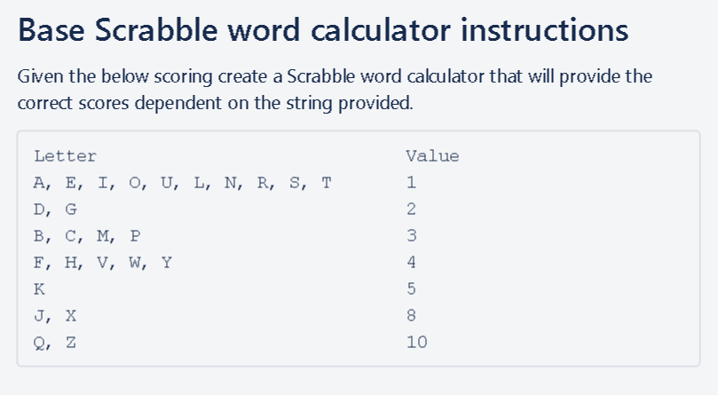

# Python OOP Task - Scrabble
## Task


## Pre-Requisites
__Necessary:__ You must have python installed.  
__Optional:__ It is easier to complete this task when using a code editor, such as Visual Studio Code or PyCharm. You can learn how to [install VSC](https://docs.microsoft.com/en-us/visualstudio/install/install-visual-studio?view=vs-2019) or [install PyCharm](https://www.jetbrains.com/help/pycharm/quick-start-guide.html) using these hyperlinks. 

## Syntax
### Step 1: Create a Scrabble `class` to contain the value of each letter. 
```python
# creating a Scrabble class to contain list of characters 
class Scrabble():


    # initialising the class by putting each category into a list
    def __init__(self):
        self.one_point = ['A', 'E', 'I', 'O', 'U', 'L', 'N', 'R', 'S', 'T' ]
        self.two_point = ['D','G']
        self.three_point = ['B', 'C', 'M', 'P']
        self.four_point = ['F', 'H', 'V', 'W', 'Y']
        self.five_point = ['K']
        self.eight_point = ['J', 'X']
        self.ten_point = ['Q','Z']
```
### Step 2: Create a Points `class` to contain the method for scoring words
First we must import the parent class:

```python
# importing the Scrabble class
from scrabble_class import Scrabble
```
Then create the class and initialise it using `super()`
```python
# creating a points class to contain point-counting method
class Points(Scrabble):
    # initialising this child class
    def __init__(self):
        super().__init__()
 ```

Creating a method to count scores:
```python
    # this function creates and increases a score based on which list each character falls into
    def count_score(self, string_input):
        score = 0 
        for letter in string_input.upper():
            # control flow for each letter
            if letter in self.one_point:
                score += 1 
            elif letter in self.two_point:
                score += 2
            elif letter in self.three_point:
                score += 3
            elif letter in self.four_point:
                score += 4
            elif letter in self.five_point:
                score += 5
            elif letter in self.eight_point:
                score += 8 
            elif letter in self.ten_point:
                score += 10 
            # if they enter a character that is not allowed, they get penalised
            else:
                score = 0
                return 'You have entered an invalid character, please try again.'
        return score
```
## Step 3: In a seperate file, write a script to prompt the user for a word and calculate a score:

Import the Points class:
```python
# importing Points class
from points_class import Points
```
Then we run the `count_points` method:
```python
# While loop to keep prompting the user for a word
while True:
    word = input('Please enter a word to calcuate your score. Enter "0" if you would like to exit.')
    if word == str(0):
        break
    # instantiating the class so we can utilise the count method
    points_object = Points()

    # printing the score in a nice way for the user
    print(f'The word "{word}" yielded you {points_object.count_score(word)} points. Well done!')
    continue
```
